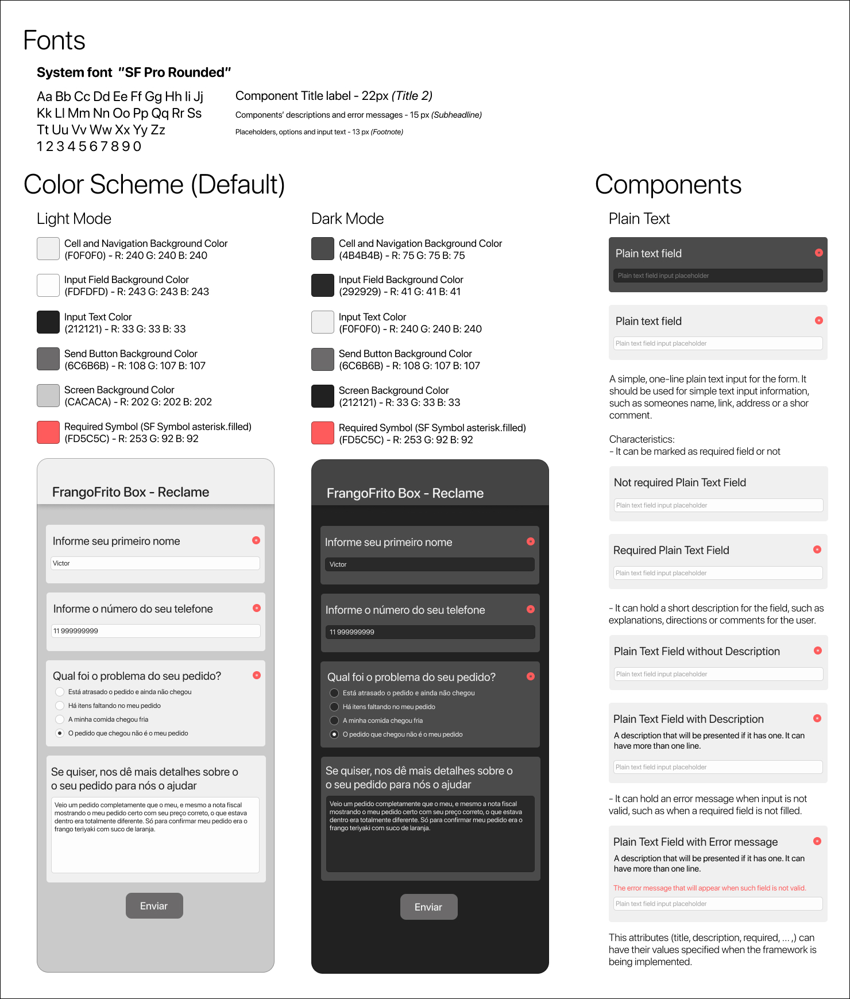

# Formworks


Formworks is a framework built on UIKit for building forms from JSON files on iOS.

1. [Features](#features)
2. [Requirements](#requirements)
3. [Usage](#usage)
    - [Installing using Swift Package Manager](#installing-using-swift-package-manager)
    - [Creating a Form](#creating-a-form)
    - [Input Validation](#input-validation)
    - [Supported Components](#supported-components)
4. [Resources](#resources)
    - [Style Guide](#style-guide)
    - [Glossary](docs/glossary.md)

## Features
- [x] Support to Single Line Component.
- [x] Every field type has the property to be optional or required.
- [x] Every field has its own type validation.
- [ ] Support to Multiple Line, Single Selection and Multiple Selection components.
- [ ] Networking layer for API requests
- [ ] Design customization.

## Requirements
- Swift 5.0 or later 
- iOS 13.0 or later
- Xcode 10.0 or later

## Usage
### Installing using Swift Package Manager
1. Create a new Xcode Project
2. In Xcode, click on "File"
3. Click on "Swift Packages"
4. Click on "Add Package Dependency"
5. Paste the web url for this repository: https://github.com/Galdineris/Formworks.git
6. Set Rules to Branch on "master"
7. Finish

### Importing Formworks to your Project
```swift
import Formworks
```
### JSON Format 
#### Required Parameters in a JSON Form:
Parameter | Type | Description 
------------ | ------------- | -------------
title | String | Form title. It will be presented in the top of the form.
components | Array | An array that constains all the components that will be presented in the form.

#### Parameters in a JSON Component:
Parameter | Type | Description | Required
------------ | ------------- | ------------- | -------------
title | String | Component's title. It should be a definition about how the field could be filled. | YES
subtitle | String | Component's description. It could be an aditional explanation about how the field could be filled. | NO
componentType | String | Defines what kind of data will be inputed in this field. <br> The types are specified on [Supported Components](#supported-components) section. | YES
errorMessage | String | Message will be displayed if the data inputed by the user in the field is invalid. | YES
required | Bool | Specifies if the field has to be filled or not.| YES
specs | Element | Optinal field customization. The parameters are specified on [Supported Specs Parameters](#supported-specs-parameters) section. | NO

#### JSON File Example
```json
{
    "title": "Formworks Research",
    "components": [
        {
            "title": "What is your name?",
            "componentType": "plain_text",
            "errorMessage": "This field is obligatory. Please, answer it.",
            "required": true,
            "specs": {
                "placeholder": "Type your name here."
            }
        },
        {
            "title": "Leave a message about this framework!",
            "subtitle": "If you want, leave a comment, suggestion or a complaint.",
            "componentType": "text_box",
            "required": false
        }
    ]
}
```
### Supported Specs Parameters
Parameter | Type | Description | Required
------------ | ------------- | ------------- | -------------
placeholder | String | The auxiliary message displayes in the field.| NO

### Creating a Form
```swift
let dataFromJSON: Data = // Fetch your JSON data.
let formViewController = FWFormViewController(for: dataFromJSON)
// present formViewController
```

### Input Validation
Our text components can be validated using regular expressions. To add a custom validation to your form component, pass a regex rule in the component's specification section in the JSON file.
Components like "Email" and "Phone Number" already have a validation rule in the supported components section.

### Supported Components
Component | JSON key | Default Validation Rule | Valid Examples
------------ | ------------- | ------------- | -------------
Plain Text | "plain_text" | - | N/A
Text Box | "text_box"| - | N/A
Email | "email" | Alphanumerical elements followed by a @ and a subsequent site address. | myemail@example.com , my2email@example.org
Numerical | "numerical" | Decimal numerals | 0 , -42, +9000
Phone Number | "phone_number" | Brazilian local phone numbers format, with or without punctuation. | 5512341234 , 912341234, (55)912341234

## Resources
### Style Guide

### [Glossary](docs/glossary.md)
